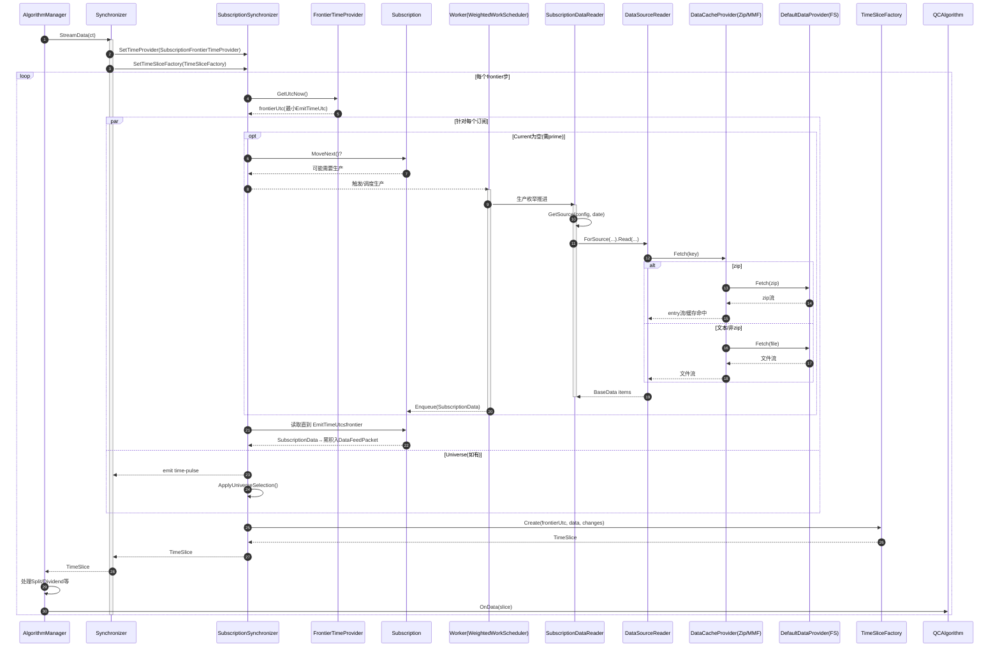

# 数据消费流程与 Synchronizer 时序图

本文从 Synchronizer 出发，串起数据从“磁盘/压缩包 → 订阅生产 → 切片同步 → OnData”的完整消费流程；并配套时序图与关键代码引用，便于交叉定位。

## 概览
- 生产者：每个 `Subscription` 对应的枚举器栈，底层由 `SubscriptionDataReader` 驱动实际 I/O。多数回测场景下通过工作线程异步预取（批量）。
- 同步者：`SubscriptionSynchronizer` 基于所有订阅的“最早可发射时间”构造统一 `TimeSlice`（含数据字典与辅助数据）。
- 时钟：`SubscriptionFrontierTimeProvider` 将 frontier 指向“所有订阅下一个可发射数据”的最小 `EmitTimeUtc`。
- 消费者：`AlgorithmManager` 在处理公司行为后，调用 `QCAlgorithm.OnData(slice)`。

---

## 模块职责与定位规则
- 定位入口
  - `BaseData.GetSource(config, date, isLive)` 决定数据源（本地/远端/对象存储、CSV 或 Zip entry 等）
    - Engine/DataFeeds/SubscriptionDataReader.cs:452
  - 按数据源格式创建 reader：Engine/DataFeeds/SubscriptionDataSourceReader.cs:29
- 路径/命名规则（统一由 `LeanData` 生成）
  - 目录：`{securityType}/{market}/{resolution}/[symbol]/...`（小时/日不含 `symbol` 末级目录）
    - Common/Util/LeanData.cs:550
  - 子日频（分/秒/时序）通常按天 zip；entry 名包含日期、分辨率、TickType 等
    - 生成相对 zip 路径：Common/Util/LeanData.cs:610
    - 生成 zip entry 名：Common/Util/LeanData.cs:673
  - 小时/日：单文件 `symbol.csv`（不分天、不在 zip 内）
    - Common/Util/LeanData.cs:691
  - 期权/指数期权/期货/期货期权等的特殊规则（是否用标的名、canonical 代码、到期标签等）
    - Common/Util/LeanData.cs:568, 572, 576, 585, 724

---

## 何时加载与缓存机制
- 加载时机（惰性加载）
  - 第一次 `MoveNext()` 延迟初始化与创建当日数据 reader；当日读尽/发生映射切换时才切下一个数据源
    - Engine/DataFeeds/SubscriptionDataReader.cs:271, 420
  - 真实 I/O 在 `CreateStreamReader()` 中，通过 `IDataCacheProvider.Fetch(key)` 获取（若 zip 需定位 entry）
    - Engine/DataFeeds/BaseSubscriptionDataSourceReader.cs:77
- 缓存层次
  - Zip 缓存：`ZipDataCacheProvider` 缓存 zip 对象与 entry 流，默认 10 秒滚动清理
    - Engine/DataFeeds/ZipDataCacheProvider.cs:62, 71, 93, 108
  - 全局内存映射缓存（优化/参数搜索）：`MemoryMappedFileCacheProvider` 跨进程共享，命中直接切片流式读取
    - Engine/DataFeeds/MemoryMappedFileCacheProvider.cs:115, 260
  - 文本数据点缓存：小时/日、部分类型由 `TextSubscriptionDataSourceReader` 进程内缓存 `BaseData` 列表并克隆返回
    - Engine/DataFeeds/TextSubscriptionDataSourceReader.cs:68, 84, 97, 152
  - 数据提供器（底层 I/O）：默认本地磁盘 `DefaultDataProvider`，zip 由 DataCacheProvider 解包
    - Engine/DataFeeds/DefaultDataProvider.cs:26
  - 回测数据源选择缓存提供器：优化时 MMF，否则 Zip 缓存
    - Engine/DataFeeds/FileSystemDataFeed.cs:79, 87

---

## 同步与请求新数据的时机（含预取）
- Frontier 驱动
  - `SubscriptionFrontierTimeProvider.GetUtcNow()` 将 frontier 取为最小 `subscription.Current.EmitTimeUtc`，必要时 prime `MoveNext()`
    - Engine/DataFeeds/SubscriptionFrontierTimeProvider.cs:37, 72
- 同步流程
  - `Synchronizer.StreamData()` 迭代 `SubscriptionSynchronizer.Sync(...)` 输出的 `TimeSlice`
    - Engine/DataFeeds/Synchronizer.cs:80
  - `SubscriptionSynchronizer` 在每个 frontier 内：
    - 遍历订阅，`while (Current.EmitTimeUtc <= frontierUtc)` 消费数据入 `DataFeedPacket`
    - 对 Universe 数据先发 time-pulse，再执行选股，合并 `SecurityChanges`
    - 用 `TimeSliceFactory.Create(...)` 生成切片
    - Engine/DataFeeds/SubscriptionSynchronizer.cs:85, 98, 141, 166, 220, 243
- 预取机制（生产者并发）
  - 回测默认通过 `CreateAndScheduleWorker` 把生产函数提交到加权调度器，按批量（默认 50）持续预读入队
    - Engine/DataFeeds/SubscriptionUtils.cs:96, 133
    - Engine/DataFeeds/WorkScheduling/WeightedWorkScheduler.cs:22
    - Engine/DataFeeds/Enumerators/EnqueueableEnumerator.cs:57
  - 因此“加载/解压”多数发生在后台工作线程推进时，不是算法线程到点才 I/O；属于有限深度的前瞻预取

---

## OnData 前的处理
- 切片构建
  - `TimeSliceFactory.Create(...)` 聚合成 `Slice`（`TradeBars/QuoteBars/Ticks`、期权/期货链、拆分/分红/退市/符号变化/利率等）并更新 `Security` 和合成器输入
    - Engine/DataFeeds/TimeSliceFactory.cs:389, 374, 379, 383, 422+
- 事件与回调
  - `AlgorithmManager` 先处理公司行为（拆分/分红），再调用 `algorithm.OnData(slice)`；随后处理交易与结果同步事件
    - Engine/AlgorithmManager.cs:737, 804, 536, 520+

---

## 典型时序图（Mermaid）



### 时序图图例（Mermaid 组合片段）
- alt（分支）：互斥分支，根据条件选择其一；子分支用 else 分隔。
  - 语法示例：
    ```
    alt 条件A
      …步骤A…
    else 条件B
      …步骤B…
    end
    ```
  - 本图用法：区分 zip 路径 与 文本/非zip 路径，只会走其中之一。
- opt（可选）：条件成立才执行，可视作单分支的 alt。
  - 语法示例：
    ```
    opt 条件
      …步骤…
    end
    ```
  - 本图用法：当订阅 Current 为空时触发 prime（预推进）逻辑。
- par（并行）：多个分支可并行/并发执行，分支之间用 and 分隔。
  - 语法示例：
    ```
    par
      …分支1…
    and
      …分支2…
    end
    ```
  - 本图用法：针对各订阅的数据生产与（如有）Universe 处理可并行推进。
- loop（循环）：表示重复执行的片段。
  - 本图用法：外层“每个 frontier 步”的循环。

---

## 可能的耗时热点（静态分析）
- 文件 I/O 与 zip 解压、entry 定位与拷贝（首次读取某文件/entry 或缓存失效时）
  - Engine/DataFeeds/ZipDataCacheProvider.cs:62, 71, 260
- CSV 解析与对象构建（高频、长文件明显）
  - Engine/DataFeeds/TextSubscriptionDataSourceReader.cs:111
- 期权/期货链构建/更新（合约多时）
  - Engine/DataFeeds/TimeSliceFactory.cs:422+
- 填充/过滤与严格日终（跨时区、分段交易时段）
  - Engine/DataFeeds/FileSystemDataFeed.cs:292
- 因子/映射文件的读取与价格缩放、符号映射日切
  - Engine/DataFeeds/SubscriptionDataReader.cs:201
- Universe 选股（大盘/基本面时）与 `SecurityChanges` 合并
  - Engine/DataFeeds/SubscriptionSynchronizer.cs:220

---

## 快速代码导览（按流程）
- 同步主循环与初始 frontier：
  - Engine/DataFeeds/Synchronizer.cs:80, 178, 183
  - Engine/DataFeeds/SubscriptionFrontierTimeProvider.cs:37, 72
- 订阅同步到切片：
  - Engine/DataFeeds/SubscriptionSynchronizer.cs:85, 120, 166, 220, 243
- 枚举器与数据源/缓存：
  - Engine/DataFeeds/SubscriptionDataReader.cs:271, 420, 452
  - Engine/DataFeeds/BaseSubscriptionDataSourceReader.cs:77
  - Engine/DataFeeds/ZipDataCacheProvider.cs:62, 93, 108
  - Engine/DataFeeds/MemoryMappedFileCacheProvider.cs:260
  - Engine/DataFeeds/TextSubscriptionDataSourceReader.cs:84, 111, 152
  - Engine/DataFeeds/DefaultDataProvider.cs:26
- 路径与命名：
  - Common/Util/LeanData.cs:550, 610, 673, 691, 724
- 切片与 OnData：
  - Engine/DataFeeds/TimeSliceFactory.cs:389
  - Engine/AlgorithmManager.cs:536, 737, 804

---

如需扩展，我可以再按具体品种（例如股票分钟或期权日线）给出真实路径 + zip entry 的完整示例，或输出工作线程的预取深度与调度权重的观测建议。

